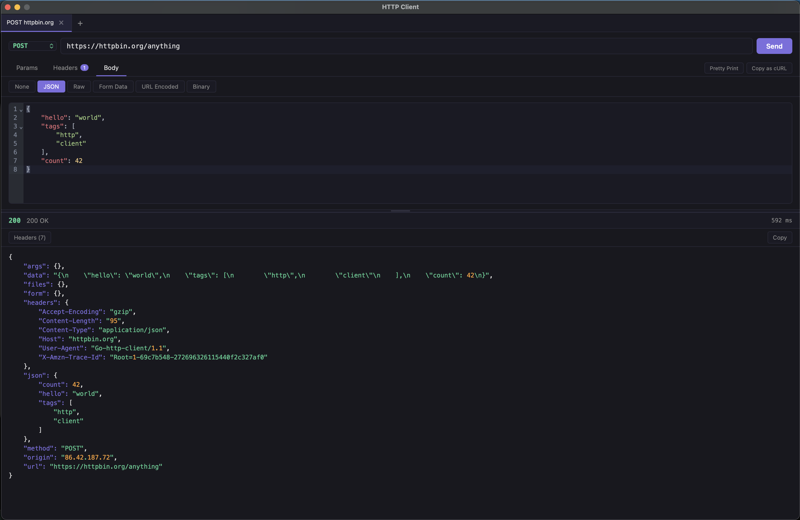

# HTTP Client

A lightweight desktop HTTP client for macOS and Linux. Single binary, no runtime dependencies.



## Features

- **Tabs** — multiple independent requests, each with their own state
- **Request builder** — method selector, URL bar, query params, headers, body
- **Body types** — JSON (with syntax highlighting), Raw, Form Data, URL Encoded, Binary
- **Response viewer** — syntax-highlighted JSON, status, timing, headers
- **cURL import/export** — paste a cURL command into the URL bar to populate the request; copy any request as cURL
- **Draggable divider** — resize the request/response split
- **Keyboard shortcuts** — `Cmd+Enter` send, `Cmd+T` new tab, `Cmd+W` close tab, `Cmd+L` focus URL

## Tech stack

- **Backend:** Go + [Wails v2](https://wails.io/) — compiles to a native binary using the OS webview
- **Frontend:** Svelte + Vite, embedded into the binary at build time
- **Editor:** CodeMirror 6 for JSON body editing

## Installation

Download the latest binary for your platform from [Releases](../../releases/tag/latest).

| Platform | File |
|----------|------|
| macOS (Apple Silicon) | `httpclient-darwin-arm64.zip` |
| macOS (Intel) | `httpclient-darwin-amd64.zip` |
| Linux | `httpclient-linux-amd64.tar.gz` |

## Building from source

**Prerequisites:**
- Go 1.23+
- Node 18+
- Wails CLI: `go install github.com/wailsapp/wails/v2/cmd/wails@latest`

```bash
# Dev mode (hot reload)
make dev

# Build and install to /Applications (macOS)
make build

# Build only (no install)
wails build
```

The binary is output to `build/bin/`.

## Releases

Every push to `master` triggers a GitHub Actions build and updates the [latest release](../../releases/tag/latest) with fresh binaries for all platforms. To work on features without releasing, use a branch.
